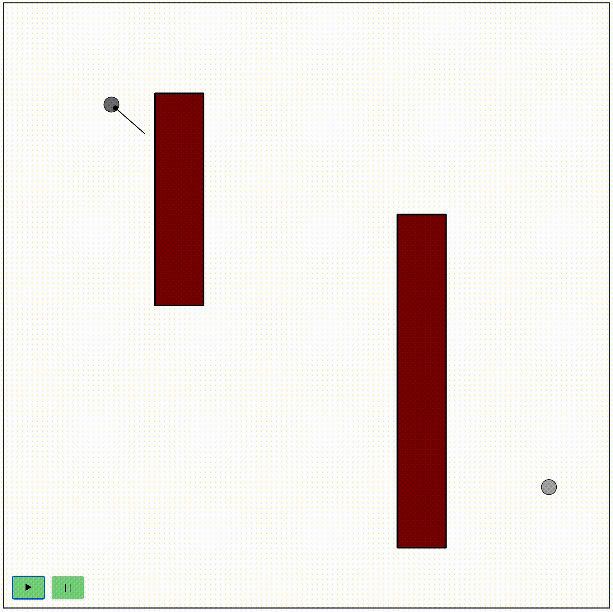

# Little Robot

This robot is programmed as a *coroutine*, rather than a state machine.



There's an online version [here](https://nitasn.github.io/little-robot/).

---

In each clock tick, the robot read from its sensors, then resumes its coroutine.

The heart of the robot's algorithm is:

```javascript
function* rotateUntilInAngle(degrees) {
  while (!isCloseToAngle(degrees)) {
    yield rotateToward(degrees);
  }
}

function* continueInThisDirectionUntilBoom() {
  while (frontDistance() > 5) {
    yield drive(100, 0);
  }
}

function* walkTowardsTarget() {
  while (true) {

    if (distanceToTarget() < 0.1) {
      return "REACHED TARGET";
    }

    if (frontDistance() < 5) {
      return "SEES OBSTACLE";
    }

    // fix direction if deviated
    yield* rotateUntilInAngle(degressToTarget());

    yield drive(100, 0);
  }
}

function* measureDegreesParallelToObject() {
  const normalDirection = yield* measureDegreesToClosestObject();

  const optionA = mod360(normalDirection + 90); // circumvent obstacle from left
  const optionB = mod360(normalDirection - 90); // circumvent obstacle from right

  const angleTowardsTarget = degressToTarget();
  const costOptionA = Math.abs(signedDeltaDeg(optionA, angleTowardsTarget));
  const costOptionB = Math.abs(signedDeltaDeg(optionB, angleTowardsTarget));

  return (costOptionA < costOptionB) ? optionA : optionB;
}

function* measureDegreesToClosestObject() {
  const DEGREES_TO_MOVE_EACH_TURN = 2;

  let minDistance = Number.POSITIVE_INFINITY;
  let argminDegrees;

  for (degreesCovered = 0; degreesCovered < 360; degreesCovered += DEGREES_TO_MOVE_EACH_TURN) {
    const distance = frontDistance();
    if (distance < minDistance) {
      argminDegrees = robot.degrees;
      minDistance = distance;
    }
    const rotation_power = Math.round(DEGREES_TO_MOVE_EACH_TURN * 100 / MAX_ANGULAR_SPEED);
    yield drive(0, rotation_power);
  }

  return argminDegrees;
}

function* mainAlgorithm() {
  while (true) {
    const whyStopped = yield* walkTowardsTarget();

    if (whyStopped == "REACHED TARGET") return; // algorithm terminates

    // if we're here,
    // we stopeed because there's an obstacle in front of us
    
    do {
      const degreesAlongObstacle = yield* measureDegreesParallelToObject();
      yield* rotateUntilInAngle(degreesAlongObstacle);
      yield* continueInThisDirectionUntilBoom();
    }
    while (!isLookingAwayFromTarget());

    // we need to rotate away from the wall before starting to walk towards target
    yield* rotateUntilInAngle(degressToTarget());
  }
}
```